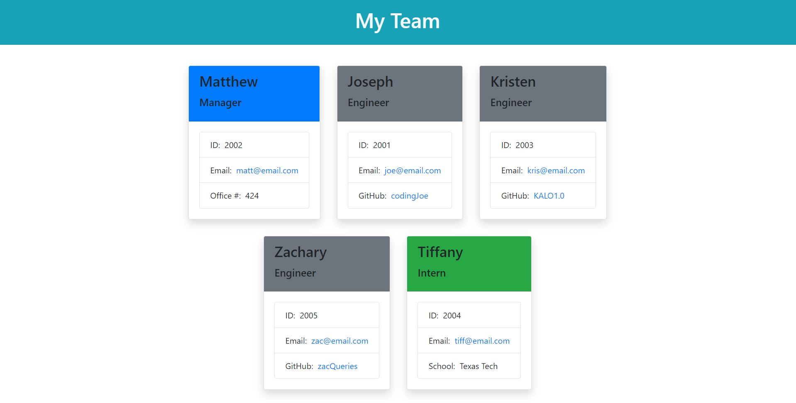

# Team Profile Generator Challenge #10

## Challenge Description:
* Created a terminal application to auto-generated an employee team roster.
* Initiated unit tests for classes: Employee, Manager, Engineer, and Intern.
* All unit tests run and pass with npm run test (using Jest).
* Inquirer is used to collect data from the user in the terminal.
* User can chose to make their team with as many employees as necessary with a Manager as the only requirement.
* Once user selects that they are ready to build their team an index.html file is generated.
* The file when opened shows the team roster with individual employee cards.
* Emails are linked to send an email to each individual.
* Github usernames are linked to the individual's GitHub profile.

## Screenshot:

## Links:
#### Link to GitHub repository:
* https://github.com/jenlpac/team-profile-generator

#### Link to walkthrough video:
* https://drive.google.com/file/d/1JIpKYJLCMeh-ydkU0-jNcCEMd6dEXlRe/view

#### Link to auto-generated sample index.html file:
* 